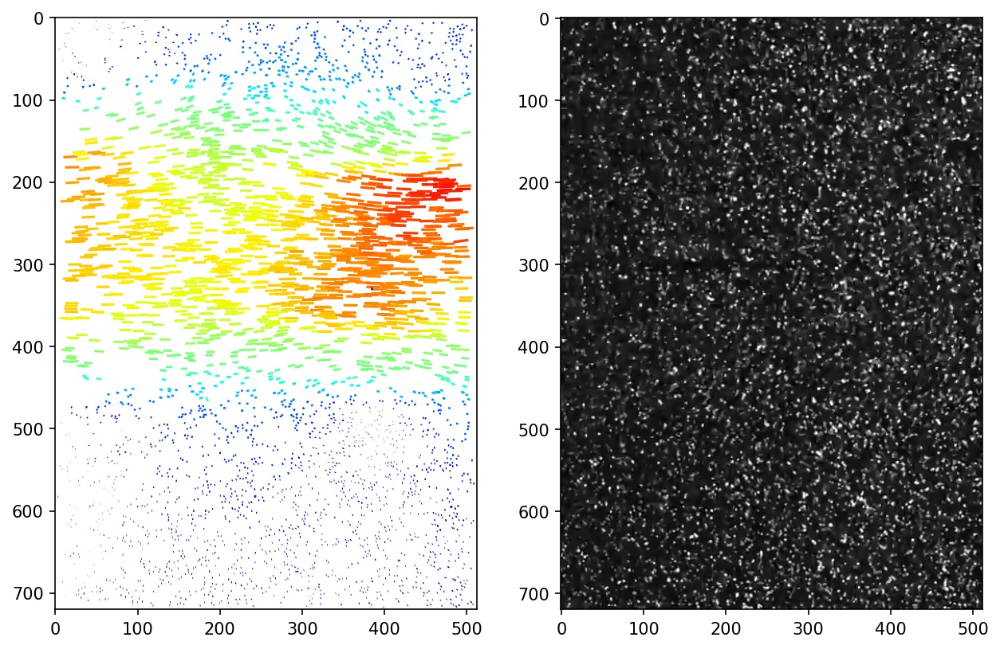
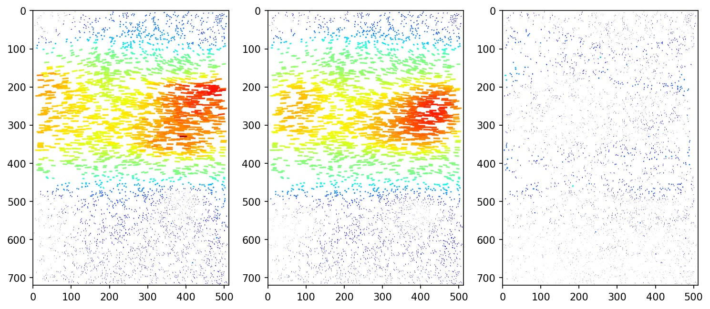

# PTV-Dataset

This repository contains a real-world dataset for scattered data interpolation. The dataset is extracted from raw images of a laminar jet with tracer particles for Particle Image Velocimetry (PIV). Each frame of the images corresponds to a velocity field. By performing particle tracking between adjacent frames, scattered data can be extracted, where each point represents a particle with associated velocity. This data can be used for scattered data interpolation to reconstruct the temperature field.

The raw images were extracted from a high-speed video captured in our Laminar Jet facility. These images were used for groundbreaking experiments in analyzing PIV Uncertainty, a topic that has recently gained attention. The images reveal Kelvin-Helmholtz instabilities as the jet sheds vortices into the surrounding air. The acquisition speed was 10 kHz, the playback speed is 20 fps, and the width of the images is approximately 13.5 mm.

## Downloading the Raw images

The raw images extracted from the experiment can be downloaded from [here](http://piv.de/uncertainty/).

## File Structure
- `extract.ipynb`: Jupyter Notebook that extracts raw images and synthesizes the scattered dataset. Each frame of the images can be used to extract a set of scattered data points with associated velocities.
- `denoise.ipynb`: Jupyter Notebook for analyzing and denoising the dataset.
- `PTV_data.py`: Example dataset encapsulation based on PyTorch Lightning, designed for learning scattered data interpolation.
- `field_data_denoised/`: Directory containing all denoised data after the denoising process.

## Visualization

Here are two visualization examples:

The first example showcases a set of particles with associated velocities directly extracted from the frames.

The second example demonstrates the comparison between the dataset before and after denoising.

Feel free to explore and utilize this dataset for your research and experiments related to scattered data interpolation.

## References

[1] _D. R. Neal, A. Sciacchitano, B. L. Smith, F. Scarano, "Collaborative Framework For PIV Uncertainty Quantification: The Experimental Database," 17th International Symposium on Applications of Laser Techniques to Fluid Mechanics, Lisbon, Portugal, July, 2014._

[2] _Ding, Shizhe, and Dongbo Bu. "NIERT: Accurate Numerical Interpolation through Unifying Scattered Data Representations using Transformer Encoder." arXiv preprint arXiv:2209.09078 (2022)._

